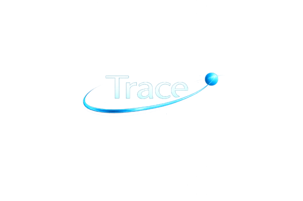
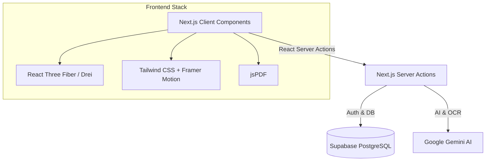
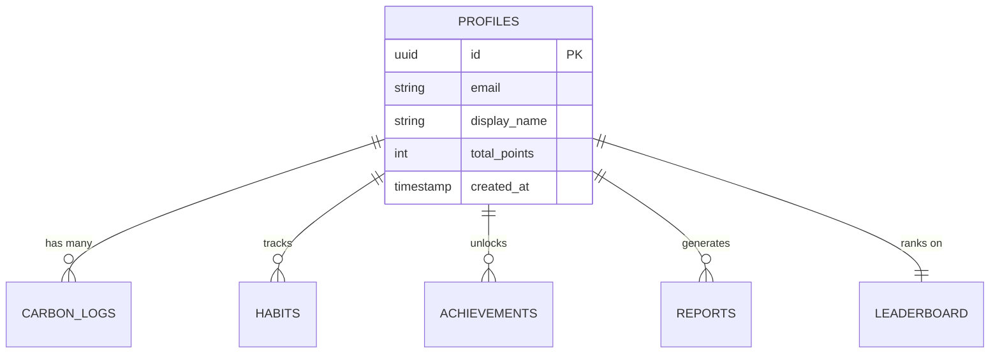
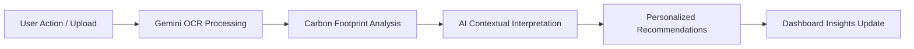

<div align="center">
  
  <h1>Trace</h1>
  <p><b>Every choice leaves a trace.</b></p>
  <p>An interactive, story-driven cinematic experience to track and reduce your carbon footprint using AI.</p>

  [](https://nextjs.org/)
  [](https://www.typescriptlang.org/)
  [](https://tailwindcss.com/)
  [](https://supabase.com/)
  [](https://deepmind.google/technologies/gemini/)
  [](https://opensource.org/licenses/MIT)
</div>

---

## 🔗 Live Demo
- **Production URL:** [trace-app.vercel.app](#) *(Placeholder)*
- **Demo Video:** [Watch on YouTube](#) *(Placeholder)*
- **LinkedIn Showcase:** [View Post](#) *(Placeholder)*

---

## 🌍 About Trace

**The Problem**
Traditional carbon tracking tools fail because they feel like tedious accounting software. They present users with overwhelming spreadsheets, dry statistics, and generic advice that lacks personal relevance. This friction prevents meaningful, long-term behavior change.

**The Solution: Trace**
Trace (formerly CarbonWise AI) transforms carbon footprint tracking from a boring spreadsheet into a cinematic, 3D interactive experience. Positioned as a cutting-edge environmental intelligence platform, Trace leverages Google Gemini AI, advanced OCR, and immersive 3D web technologies to make carbon tracking intuitive, engaging, and highly personalized. By combining intelligent receipt analysis with cinematic storytelling, Trace provides users with real-time, context-aware coaching that transforms overwhelming climate anxiety into actionable, everyday empowerment. Built with ❤️ for **PromptWars**.

---

## ✨ Why Trace?

Trace completely breaks the mold of traditional sustainability tools by delivering a premium, engaging user experience:

- 🎬 **Cinematic Storytelling:** Immersive 3D environments (React Three Fiber) that make environmental impact visually stunning and emotionally resonant.
- 🧠 **AI-Powered Guidance:** A Gemini-powered AI Coach that understands your unique lifestyle and provides context-aware, achievable recommendations.
- 📄 **Intelligent OCR Extraction:** Simply upload a utility bill or receipt; our OCR engine automatically extracts usage data and calculates your exact footprint.
- 📊 **Interactive Visualizations:** A sleek, glassmorphism "Mission Control" dashboard that brings your data to life.
- 🎯 **Personalized Recommendations:** Actionable insights tailored specifically to your habits, maximizing your personal impact.

---

## 📸 Feature Showcase

| Feature | Description | Screenshot |
|---|---|---|
| **Immersive Hero** | Cinematic 3D Earth UI providing an interactive landing experience. |  |
| **Sleek HUD Dashboard** | A transparent, glassmorphism "Mission Control" interface for high-level analytics. |  |
| **Smart AI Coach** | Google Gemini-powered environmental advice and lifestyle coaching. |  |
| **OCR Bill Scanner** | Instant carbon calculation from uploaded utility bills and receipts. |  |
| **Carbon Calculator** | Intuitive, interactive tools to log daily transport, energy, and food footprint. |  |
| **Dynamic PDF Reports** | Download branded, professional monthly footprint analyses. |  |

---

## 🏗 Architecture

Trace is built on a scalable, production-grade modern stack.



---

## 🗄 Database Architecture



---

## 🧠 AI Workflow

How Trace translates user data into actionable environmental intelligence:



---

## 🚀 Installation Guide

### Prerequisites
- Node.js 18+
- npm or pnpm
- Supabase Project
- Google Gemini API Key

### Local Setup
1. **Clone the repository:**
   ```bash
   git clone https://github.com/your-username/trace.git
   cd trace
   ```

2. **Install dependencies:**
   ```bash
   npm install
   ```

3. **Configure Environment Variables:**
   Duplicate the `.env.example` file to `.env.local` and fill in your keys.

4. **Run the development server:**
   ```bash
   npm run dev
   ```
   Open [http://localhost:3000](http://localhost:3000) in your browser.

## 🔐 Environment Variables

Create a `.env.local` file in the root directory with the following variables. **Never commit this file.**

```env
# Supabase Configuration
NEXT_PUBLIC_SUPABASE_URL="your-supabase-project-url"
NEXT_PUBLIC_SUPABASE_ANON_KEY="your-supabase-anon-key"

# Google Gemini API (For AI Coach & OCR)
GEMINI_API_KEY="your-gemini-api-key"
```

## 🚢 Deployment Guide (Vercel)

Trace is optimized for Vercel deployment.

1. Push your code to GitHub.
2. Log into [Vercel](https://vercel.com) and click **"Add New Project"**.
3. Import your GitHub repository.
4. **Important:** Add your Environment Variables (`NEXT_PUBLIC_SUPABASE_URL`, `NEXT_PUBLIC_SUPABASE_ANON_KEY`, `GEMINI_API_KEY`) in the Vercel dashboard.
5. Click **Deploy**.

## 🛡 Security
- `.gitignore` successfully excludes all `.env` files.
- The `app/(dashboard)/layout.tsx` enforces server-side Supabase session validation—no offline bypasses.
- Strict PostgreSQL Row Level Security (RLS) policies ensure users can only access their own data.
- Server-side validation of all Gemini AI requests.

---

## 🏆 PromptWars 2026 Submission

**Challenge:** Carbon Footprint Awareness Platform

**Objective:** Help individuals understand, track, and reduce their carbon footprint through simple actions and personalized insights.

**How Trace Fulfills the Challenge:**
Trace goes beyond basic data entry by incorporating multimodal AI (Gemini OCR) for frictionless logging, and generative AI for personalized coaching. The premium, cinematic UI keeps users engaged, effectively turning sustainability from an obligation into an interactive journey. Trace hits every requirement of the prompt while elevating the UX to startup-grade standards.

---

## 🚀 Future Roadmap

- **Q3 2026:** Advanced Carbon Forecasting & Predictive AI Models
- **Q4 2026:** Team & Enterprise Sustainability Challenges
- **Q1 2027:** Social Community Impact Metrics & Leaderboards
- **Q2 2027:** React Native Mobile App Release

---
*Built with ❤️ for PromptWars.*
