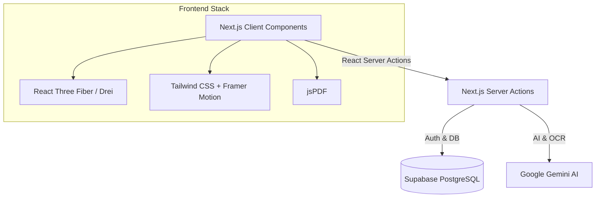

<div align="center">
  
  <h1>Trace: Every choice leaves a trace.</h1>
  <p>An interactive, story-driven cinematic experience to track and reduce your carbon footprint using AI.</p>

  [](https://nextjs.org/)
  [](https://www.typescriptlang.org/)
  [](https://tailwindcss.com/)
  [](https://supabase.com/)
  [](https://deepmind.google/technologies/gemini/)
</div>

---

## 🌍 About Trace

Trace (formerly CarbonWise AI) transforms carbon footprint tracking from a boring spreadsheet into a cinematic, 3D interactive experience. Built for **PromptWars**, Trace translates your daily actions into precise environmental telemetry, providing personalized AI coaching to help you live a greener life.

## ✨ Feature Showcase

- **Cinematic 3D Earth UI:** Built with React Three Fiber, providing a fully interactive, rotating globe backdrop.
- **Smart AI Coach:** Powered by **Google Gemini**, delivering context-aware environmental advice and receipt analysis.
- **OCR Bill Scanner:** Upload utility bills or receipts and let the AI extract and calculate your exact carbon footprint automatically.
- **Sleek HUD Dashboard:** A transparent, glassmorphism "Mission Control" interface.
- **Dynamic PDF Reports:** Download your monthly footprint analysis instantly as a branded PDF.
- **Full Authentication:** Secure login and profile management via Supabase.

## 📸 Screenshots
*(Coming soon: Place your high-res screenshots here)*

## 🏗 Architecture



## 🚀 Installation Guide

### Prerequisites
- Node.js 18+
- npm or pnpm
- Supabase Project
- Google Gemini API Key

### Local Setup
1. **Clone the repository:**
   ```bash
   git clone https://github.com/your-username/trace.git
   cd trace
   ```

2. **Install dependencies:**
   ```bash
   npm install
   ```

3. **Configure Environment Variables:**
   Duplicate the `.env.example` file to `.env.local` and fill in your keys.

4. **Run the development server:**
   ```bash
   npm run dev
   ```
   Open [http://localhost:3000](http://localhost:3000) in your browser.

## 🔐 Environment Variables

Create a `.env.local` file in the root directory with the following variables. **Never commit this file.**

```env
# Supabase Configuration
NEXT_PUBLIC_SUPABASE_URL="your-supabase-project-url"
NEXT_PUBLIC_SUPABASE_ANON_KEY="your-supabase-anon-key"

# Google Gemini API (For AI Coach & OCR)
GEMINI_API_KEY="your-gemini-api-key"
```

## 🚢 Deployment Guide (Vercel)

Trace is optimized for Vercel deployment.

1. Push your code to GitHub.
2. Log into [Vercel](https://vercel.com) and click **"Add New Project"**.
3. Import your GitHub repository.
4. **Important:** Add your Environment Variables (`NEXT_PUBLIC_SUPABASE_URL`, `NEXT_PUBLIC_SUPABASE_ANON_KEY`, `GEMINI_API_KEY`) in the Vercel dashboard.
5. Click **Deploy**.

## 🛡 Security
- `.gitignore` successfully excludes all `.env` files.
- The `app/(dashboard)/layout.tsx` enforces server-side Supabase session validation—no offline bypasses.

---
*Built with ❤️ for PromptWars.*
