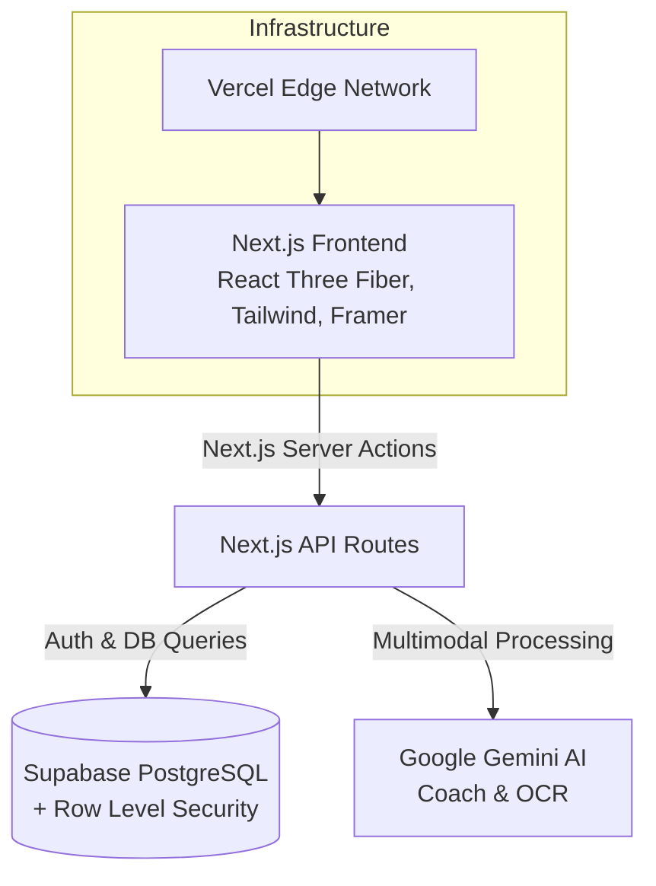
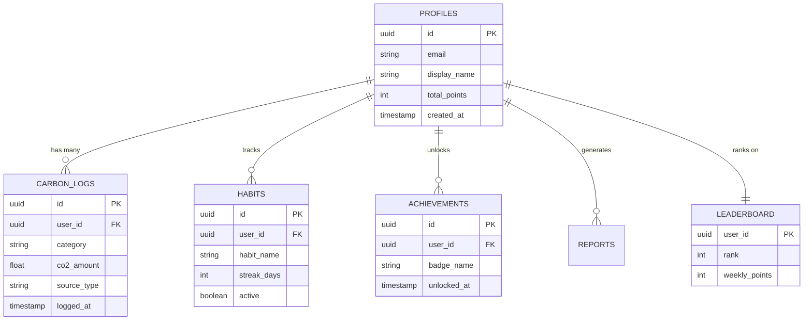
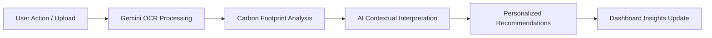

  
  <h1>Trace</h1>
  
<b>Every choice leaves a trace.</b>

  
AI-powered environmental intelligence platform that helps individuals understand, track, and reduce their carbon footprint through immersive storytelling, AI coaching, and intelligent environmental insights.

  
  
  
  
  
  
  

---

## 🔗 Live Demo
- **Production URL:** [trace-app.vercel.app](#) *(Placeholder)*
- **Demo Video:** [Watch on YouTube](#) *(Placeholder)*
- **LinkedIn Showcase:** [View Post](#) *(Placeholder)*

---

## 🌍 Introduction

**The Problem**
Traditional carbon tracking tools fail because they feel like tedious accounting software. They present users with overwhelming spreadsheets, dry statistics, and generic advice that lacks personal relevance. This friction prevents meaningful, long-term behavior change.

**The Solution: Trace**
Trace reimagines environmental responsibility as a compelling, premium experience. Positioned as a cutting-edge environmental intelligence platform rather than a simple calculator, Trace leverages Google Gemini AI, advanced OCR, and immersive 3D web technologies to make carbon tracking intuitive, engaging, and highly personalized. By combining intelligent receipt analysis with cinematic storytelling, Trace provides users with real-time, context-aware coaching that transforms overwhelming climate anxiety into actionable, everyday empowerment.

---

## ✨ Why Trace?

Trace completely breaks the mold of traditional sustainability tools by delivering a premium, engaging user experience:

- 🎬 **Cinematic Storytelling:** Immersive 3D environments (React Three Fiber) that make environmental impact visually stunning and emotionally resonant.
- 🧠 **AI-Powered Guidance:** A Gemini-powered AI Coach that understands your unique lifestyle and provides context-aware, achievable recommendations.
- 📄 **Intelligent OCR Extraction:** Simply upload a utility bill or receipt; our OCR engine automatically extracts usage data and calculates your exact footprint.
- 📊 **Interactive Visualizations:** A sleek, glassmorphism "Mission Control" dashboard that brings your data to life.
- 🎯 **Personalized Recommendations:** Actionable insights tailored specifically to your habits, maximizing your personal impact.
- 💎 **Premium User Experience:** Modern, frictionless UI design focused on conversion and retention.

---

## 📸 Feature Showcase

| Feature | Description | Screenshot |
|---|---|---|
| **Immersive Hero** | Cinematic 3D Earth UI providing an interactive landing experience. |  |
| **Sleek HUD Dashboard** | A transparent, glassmorphism "Mission Control" interface for high-level analytics. |  |
| **Smart AI Coach** | Google Gemini-powered environmental advice and lifestyle coaching. |  |
| **OCR Bill Scanner** | Instant carbon calculation from uploaded utility bills and receipts. |  |
| **Carbon Calculator** | Intuitive, interactive tools to log daily transport, energy, and food footprint. |  |
| **Dynamic PDF Reports** | Download branded, professional monthly footprint analyses. |  |

---

## 🏗 Architecture

Trace is built on a scalable, production-grade modern stack.

### Tech Stack
- **Frontend:** Next.js 15, TypeScript, Tailwind CSS, Framer Motion, GSAP, React Three Fiber
- **Backend:** Supabase Auth, PostgreSQL, Row Level Security (RLS)
- **AI Layer:** Gemini AI Coach, Gemini OCR Processing
- **Infrastructure:** Vercel Edge Delivery

### Architecture Diagram

---

## 🗄 Database Architecture

---

## 🧠 AI Workflow

How Trace translates user data into actionable environmental intelligence:

---

## ⚡ Performance Optimization

Trace is engineered for blazing-fast performance without compromising visual fidelity:
- **Responsive Design & Mobile Optimization:** Fluid layouts that adapt beautifully to any device.
- **Lazy Loading & Suspense:** Strategic code-splitting ensures instant initial page loads.
- **Three.js Performance:** Optimized geometry, compressed textures, and efficient render loops for smooth 60fps 3D graphics.
- **Error Boundaries:** Robust client-side error handling prevents total application crashes.
- **SEO Implementation:** Next.js metadata API utilization for strong search engine visibility.

---

## 🛡 Security Posture

Production-grade security is baked in from day one:
- **Authentication:** Powered by Supabase Auth with secure JWT session management.
- **Row Level Security (RLS):** Strict PostgreSQL policies ensure users can only access their own data.
- **Environment Protection:** Rigorous separation of client and server secrets.
- **Secure API Routes:** Server-side validation of all Gemini AI and database requests.

---

## 🏆 PromptWars 2026 Submission

**Challenge:** Carbon Footprint Awareness Platform

**Objective:** Help individuals understand, track, and reduce their carbon footprint through simple actions and personalized insights.

**How Trace Fulfills the Challenge:**
Trace goes beyond basic data entry by incorporating multimodal AI (Gemini OCR) for frictionless logging, and generative AI for personalized coaching. The premium, cinematic UI keeps users engaged, effectively turning sustainability from an obligation into an interactive journey. Trace hits every requirement of the prompt while elevating the UX to startup-grade standards.

---

## 🚀 Future Roadmap

- **Q3 2026:** Advanced Carbon Forecasting & Predictive AI Models
- **Q4 2026:** Team & Enterprise Sustainability Challenges
- **Q1 2027:** Social Community Impact Metrics & Leaderboards
- **Q2 2027:** React Native Mobile App Release
